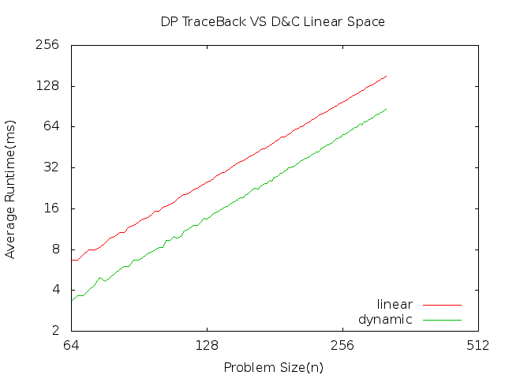
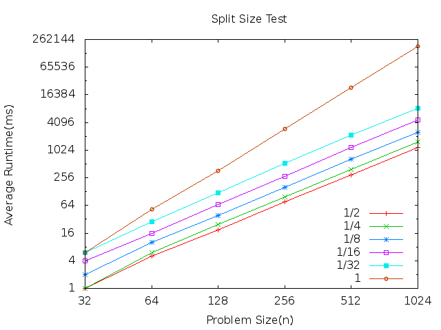

Assignemt 2 - Knapsack
======================

Alan Christensen - A01072246
February 11, 2014

This assignment compares the **Dynamic Programming Traceback** method with the **Divide and Conquer Linear-Space** algorithm. We know that the Dynamic Programming method is faster but it takes a lot of space. We are trying to use the Divide and Conquer method to get those same results with a linear space algorithm. We have designed it to take about two times as long but it is in n space instead of n squared space.

Here are the results. I used problem sizes from 64 to as much as I can increasing the problem size by two. 

This plots the average runtime vs problems size(Number of items available). I averaged the run times over 30 runs. The axis are both in log2 scale. The acutal data can be found in the file dynamicVSlinear. As we can see from the lines on the graph, the D&amp;C Linear Space algorithm is taking very close to **twice as long**. This is exactly what we had hoped to see from our algorithm analysis!

------------------------------------------------

I also compared the split size on the recursion to see if it is better to always split the problem in half. It tests where the problem is still split in two but it is split where on side is n x k and the other is n x (1-k). Where k= 1/2, 1/4, 1/8, 1/16, 1/32, 1. This is a test to see what difference it makes when we split the problem.

