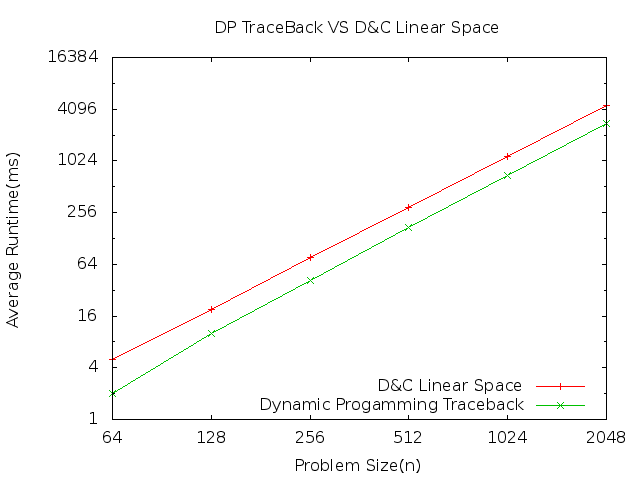

Assignemt 2 - Knapsack
======================

Alan Christensen - A01072246
February 11, 2014

This assignment compares the Divide and Conquer Linear-Space algorithm with the Dynamic Programming Traceback method. We know that the Dynamic Programming method is faster but it takes a lot of space. We are trying to use the Divide and Conquer method to get those same results with a linear space algorithm. We have designed it to take about two times as long but it is in n space instead of n squared space.

Here are the results. I used problem sizes from 64 to as much as I can increasing the problem size by two. 

