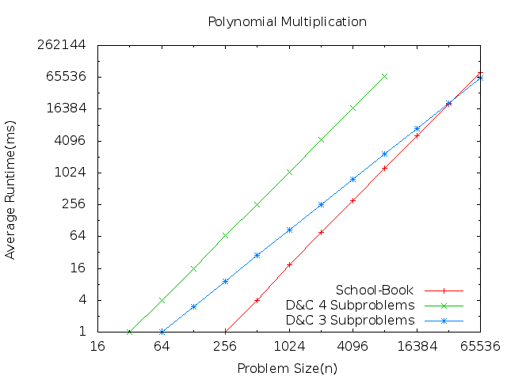

Assigment 3 - Polynomial Multiplication
=======================================

I have implemented the three algorithms:

1. Simple school-book algorithm using two nested for loops.
2. Simple divide and conquer recursive algorithm that generates **four** subproblems
3. More complex divide and conquer algorithm that generates **three** subproblems

The graph below shows the runtime in ms vs the problem size **n** of the three algoritms plotted together.

On each iteration I am doubling the problem size, starting at **n=32**.

### What is the cause of the offset between algorithms (1 School-Book) and (2 D&C 4 Subproblems) above?

As we can see from the graph, algorithm (1) and (2) have the same slope but (2) is translated up considerably. This is due to the memory required to run the algorithm. In each recursive call we are creating new vectors to have a copy of PL, PH, QL, and QH. Basically we are adding double the memory to split each vector in half and have a copy to work with. So the overhead is greater in algorithm (2) but as we can see the slope is the same.

### Where is the crossing point of algoritm (1 School-Book) and (3 D&C 3 Subproblems)?

The crossing point is at 16384 ms.

### What is the reason for this?

This happens because (3) has the same issues as dicussed above about (2). The creating and deleting of copies of the vectors takes time. But the runtime eventually gets faster because (3) is the more efficient algorithm it just has more overhead so it takes a larger problem to be more efficient.

### Calculate the exact slopes of the lines for all three algorithms.

1. 2?
2. 2?
3. 1.585?

My results are very close to what I had expected to happen.