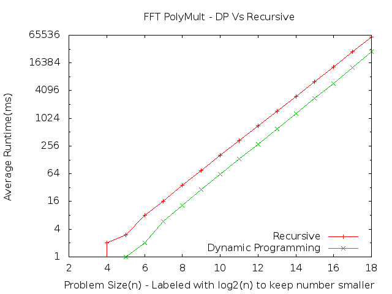

Assigment 4 - Fast Fourier transform
=======================================

The following number correspond to the numbers in the assignment.

1. I implemented the recursive FFT correctly. Make and run "./FFT test fftworks" to test.

2. To apply the recursive PolyMult FFT method to two polynomials run "./FFT test pmr" and "./FFT test polymultworks".

3. To check that the computed values are correct and check against older versions of PolyMult run "./FFT test fftvsold".

4. To apply the recursive DP FFT method to two polynomials run "./FFT test pmd" and "./FFT test polymultworks".

5. To run timing studies make and run "./FFT run pmr" for recursive and "./FFT run pmd" for DP.

### Graph of the Results

