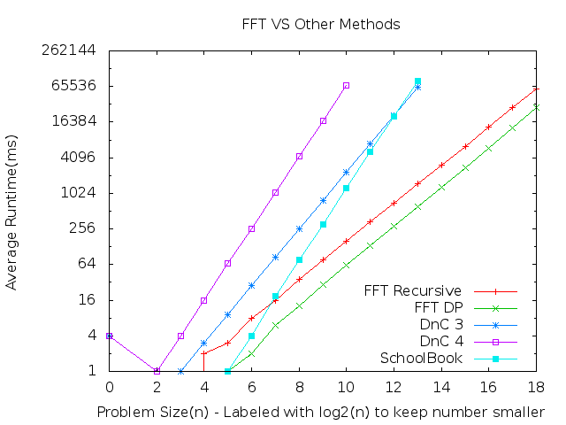

Assigment 4 - Fast Fourier transform
=======================================

The following number correspond to the numbers in the assignment.

1. I implemented the recursive FFT correctly. Make and run "./FFT test fftworks" to test.

2. To apply the recursive PolyMult FFT method to two polynomials run "./FFT test pmr" and "./FFT test polymultworks".

3. To check that the computed values are correct and check against older versions of PolyMult run "./FFT test fftvsold".

4. To apply the recursive DP FFT method to two polynomials run "./FFT test pmd" and "./FFT test polymultworks".

5. To run timing studies make and run "./FFT run pmr" for recursive and "./FFT run pmd" for DP.

### Graph of the Results

This graph shows the average runtime versus the problem size. The runtime is in milliseconds and the Problem size is shown as log2(n). The numbers were too big to look good on the graph.

Looking at the plot the recursive seems to take about 2 times as long to compute. It starts out nearer to 3 and comes closer to 2 as the problem size gets bigger.

6. Comparison of FFT vs Other methods we have done.

      | FFT R | FFT D | DnC 3 | DnC 4 |  SB
:---: | :---: | :---: | :---: | :---: | :---:
FFT R |   NA  |  ?1   | ~2^4  | ~2^2  |  ~2^7
FFT D |       |  NA   | ~2^2  | Nope  |  ~2^6
DnC 3 |       |       |  NA   | Nope  |  ~2^12
DnC 4 |       |       |       |  NA   |  ~2^20 ?2
 SB   |       |       |       |       |  NA

*?1 The recursive seems to be at a slope that is slightly less then the dynamic. So It might pass a very large numbers.*
*?2 2^20 is a projection. I don't have enough results to be sure.*