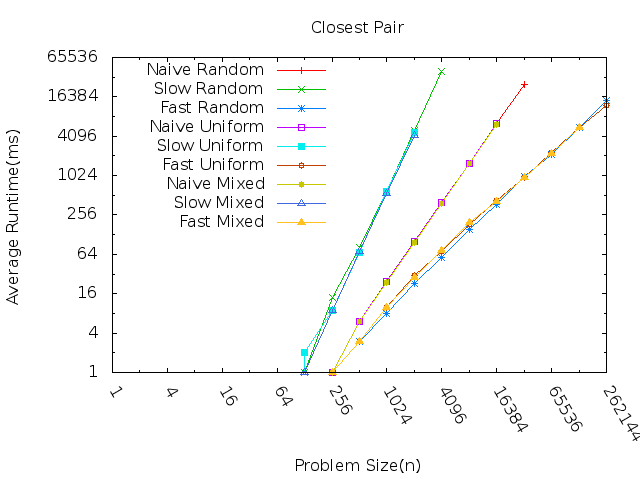

Assignemt 5 - Closest Pair
==========================

This graph shows each solution (naive, slow divide and conquer, fast divide and conquer) run against each disrtibution of points.

As we can see the naive(n^2) algorithm doesn't change with the different distributions. This is what I expected. It doesn't matter where the data is compared to each other. The algorithm compares every point to every other point.

The distribution of the points doesn't seem to make much difference. I think this is because my implementation doesn't take advantage of the location of the points as much. The only time the location matters is when we are examining the strip in the middle of the split. 

I noticed that the Slow DnC is not that good. It must have too many to check in the center strip so the DnC doesn't actually help but it hurts the performace. This goes to show that to beat the naive algoritms there is usually some trick that has to be used. 
