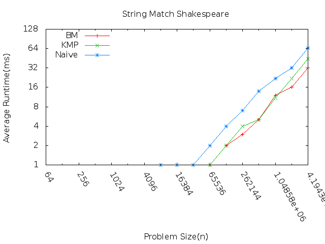
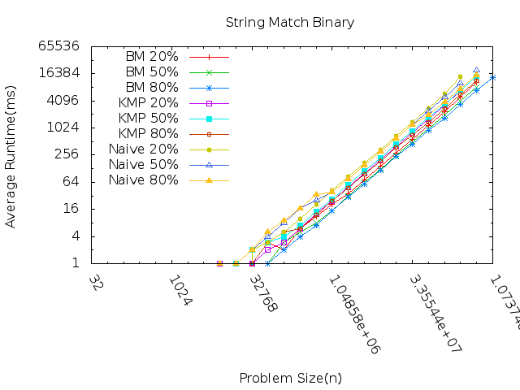
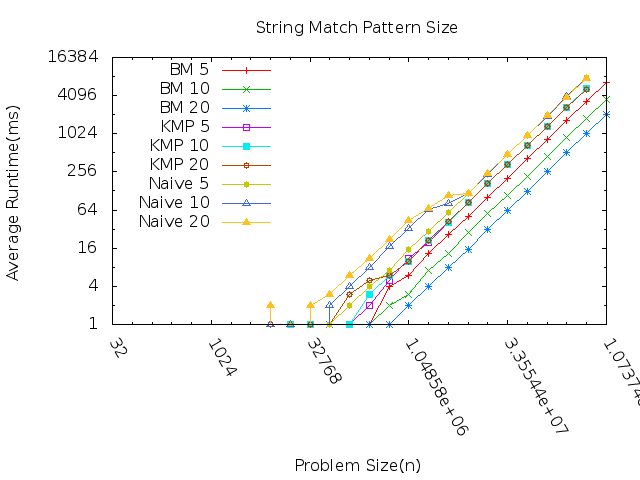

Assignment 6 string matching
============================

**Three questions**

1. Which algorithm runs faster on the complete works of shakespeare?
2. How does the regularity of a binary string affect performance?
3. Given three different pattern lengths, how is performance affected on each algoritm?

**Which algorithm runs faster on the complete works of shakespeare?**

The problem size is how much of the Shakespeare text was searched. Each algorithm was tested and searched for the word "anyone". As we can see the BM algorithm seems to be the fastest. I was at first expecting that the naive algorithm would be on a different slope. I then realized that it would not be n^2 but is n*m. The lenghth of the text to search is n and the length of the pattern is m. With the pattern being "anyone", the m is a constant of 6. This makes the naive algorithm basically an O(n) algoritm as we get bigger n's. 

**How does the regularity of a binary string affect performance?**

The problem size corresponds to the length of the binary text that we are searching through. According to this graph the run times of all three algorithms is similar no matter the regularity. I do note that the BM algorithm is the fastest and the naive algorithm is the slowest. It also seems that the 20% regularity is takes longer to run than the 50% and the 50% longer than the 80%. The naive algorithm turned out the same for the three regularities. This makes sense because the pattern has no effect on how it works. 

**Given three different pattern lengths, how is performance affected on each algoritm?**

This study turned out a little more interesting. 

It seems that the BM algorithm benefits from longer search patterns. There is a distinct difference in the three runtimes. 

The KMP algorithm doesn't seem to get any benefit from longer patterns. There is some fluctuation in the shorter length texts but as the text got bigger the algorithm performed essentially the same on the three pattern lengths. 

The Naive does better with the shorter pattern on the smaller texts but also as the text got really long the runtimes converged.
