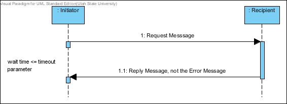
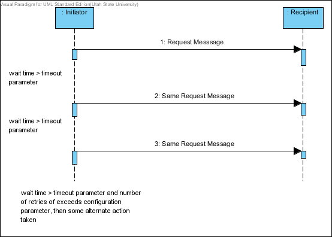
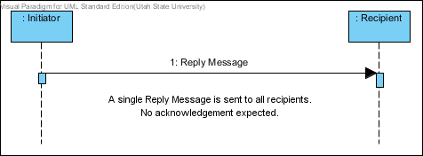

### Brilliant Students VS Zombie Professors

Protocol Definition
===================

Overview
-----------

This document defines the communication protocol to be used in the *Brilliant Student VS Zombie Professors* game.

### Actors

* Game Promoter
* Game Player
* Game Referee

### Basic Components (Agents)

Code    | Name
------- | ----
Field   | Playing Field
Clock   | Clock Tower
Student | Brilliant Student
Excuse  | Excuse Generator
Whine   | Whining Spinner
Monitor | Monitor
Zombie  | Zombie Professor

The communication between the actors and the basic components will be described.

Conversations, Communication Patterns, and Messages
---------------------------------------------------

Table 1 lists the possible types of conversations involved in the system. It describes the protocol, initiator, participants, and pattern involved in the conversations. Figures 2-4 illustrate the *Request-Reply* pattern. Figure 5 illustates the *One-Way* pattern.

### Table 1 - Converstations and Protocols

ID | Protocol       | Initiator | Recipients    | Pattern       | Request Class | Reply Class
---| -------------- | --------- | ------------- | ------------- | ------------- | -----------
01 | Register       | Any Agent | Game          | Request-Reply | Register      | Assignment
02 | ClockTick      | Clock     | All Agents    | One-Way       | ClockTick     | N/A
03 | Move           | Student   | Field         | Request-Reply | Move          | NewLocation
04 | GetParameters  | Any Agent | Game          | Request-Reply | GetParameters | ParameterList
05 | GetField       | Student   | Game          | Request-Reply | GetField      | Field
06 | GetLayout      | Student   | Field         | Request-Reply | GetLayout     | Layout
07 | ListAgents     | Student   | Field         | Request-Reply | ListAgents    | AgentList
08 | GetResource    | Student   | Excuse,Whine  | Request-Reply | GetResource   | Recource
09 | ThrowBomb      | Student   | Field         | Request-Reply | ThrowBomb     | Acknowledge
10 | DiscussTarget  | Student   | Student       | Request-Reply | DiscussTarget | TargetStrategy
11 | TakeHit        | Field     | Any Agent     | Request-Reply | TakeHit       | ImHit

### Protocol Description

* Register - Send endPoint, type, and A-Number to Game.
* ClockTick - The clock tower sends out ticks to all agents as a resource.
* Move - Send id, valid ClockTick, and coordinate. Recieve NewLocation.
* GetParameters - Get Game configuration parameters as a list.
* GetField - Get Field endPoint.
* GetLayout - Get Field layout. Includes: width, height.
* ListAgents - Send id, and which. The wich is Zombies, Students, Excuses, Whines, or All. Get a list of the desired Agents.
* GetResource - Get Whinig Twine From Whine or Excuse from Excuse.
* ThrowBomb - Send valid ClockTicks and Coordinate to Field to throw bomb.
* DiscussTarget - Send message to another Student. Include: Who and where to attack or run and direction.
* TakeHit - Amount of Hit Points lost by agent in attack and who attacked. Respond with new Hit Points.

### Figure 01 - Message Classes for Brilliant Students VS Zombie Professors

### Figure 02 - Successful Request-Reply Communication Pattern

### Figure 03 - General Timeout Situtation

### Figure 04 - Abort Situation

### Figure 05 - One-Way Communication Pattern

Message Encoding/Decoding
-------------------------

A message will be decoded in the following way.

Each message will be derived from the abstract class message. Then it will be recursively defined through the class hierarchy. The message class will ass the message and conversation ids. Each class including the message class will add a number to define which base class is to be used next to decode the mesage. All messages will be decoded using the ByteList class.

### Encoding Scheme

All values will be converted to their string representations then converted to bytes.

* Integers - Each integer is written in ascii format. The number of bytes is decided by the possible values.
* Char - Encoded in ascii. One Byte.
* String - Two byte integer to encode the length. Then followed by ascii character values.
* Boolean - One byte true(1) or false(0).
* Array - Two byte count followed by each element is written using it's primitive value's encoding.
* Object - Encoded recursively as the Message Class.