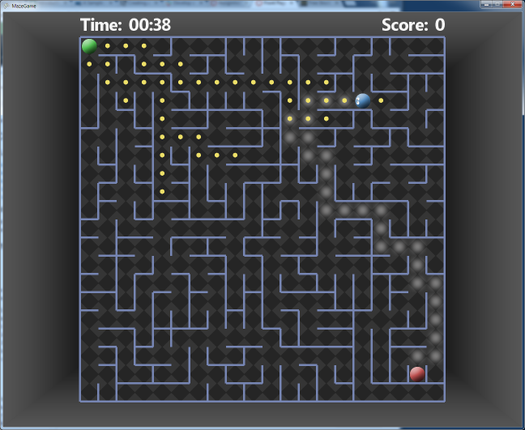

Assignment 2
============

**Due** Feb 10 by 11:59pm **Points** 50

Introduction
------------

Write a program that automatically generates mazes for a player to solve.  The purpose of this assignment is to help you learn to build a basic 2D HTML Canvas game, along with exercising some of those Data Structures & Algorithms neurons from your CS1/2/3 courses.  The program will generate random mazes according to a size chosen by the player, then allow the player to solve it, while keeping score and providing the ability to offer hints.

Assignment
----------

Write a 2D HTML Canvas game according to the following specifications...

* Random generation of mazes using either of the Randomized Kruskal's, or Randomized Prim's algorithms, but not the Depth-First algorithm. Refer to the following Wikipedia page for maze generation algorithms: http://en.wikipedia.org/wiki/Maze_generation_algorithm
* User may choose mazes of size 5x5, 10x10, 15x15 and 20x20
* Hint Option : Tells the user the next best square to choose
* In Game Scoring
  * 5 points for each correct square along shortest path.
  * -1 for square adjacent to shortest path; only the first time the user enters the square.
  * -2 for all other squares; only the first time the user enters the square.
* Simple menu system : New Game, High Scores, Credits
* User Interface that shows the current player score and elapsed time (accurate to the number of seconds)
* When starting the game, place a player marker the first cell in the maze.
* As the player moves, they leave a breadcrumb trail behind showing which cells have been visited.
* Other Requirements
  * Ability to toggle a breadcrumbs trail.
  * Ability to toggle shortest path to the finish (remember the stack concept).
  * Ability to toggle the live display of the score.
  
Many of the above capabilities mean you have to write code that can find the shortest path. This can be done by using a breadth-first search, but feel free to use any reasonable technique. Here is a wiki link that talks about different maze solving algorithms, with a reference to using breadth-first search to find the shortest path (with multiple solutions) http://en.wikipedia.org/wiki/Maze_solving_algorithm 

Control Scheme
--------------

Player movement is controlled by using the arrow keys and WASD/IJKL keys.  For the additional requirements, please use the following controls:

* Hint toggle : Keyboard H
* Breadcrumbs toggle : Keyboard B
* Path to finish toggle : Keyboard P
* Score toggle : Keyboard Y

Technical Notes
---------------

Your code must have a game loop that follows the pattern learned from the first assignment.  It should loop something like...

```javascript
function gameLoop() {
    //...compute elapsed time...
    update(elapsedTime);
    render(elapsedTime);
    requestAnimationFrame(gameLoop);
}
```

Once again, all of your game code should be placed inside of a namespace or module named MazeGame.  You may spread your code over multiple .js files if you like.

Development Notes
-----------------

At the time this assignment is given, I have not yet presented lectures on how to do any kind of Canvas rendering or how to collected keyboard input.  These techniques are relatively easy and come in the first few days.  My very, very strong recommendation is to begin the assignment by first working on developing the JavaScript code to generate the random mazes.  You can create a simple HTML page and associated JavaScript file and begin working on the maze generation algorithm.  You can also work on the game model, such as modeling the player position in the maze and the different move and scoring capabilities.  Once you then know how to render shapes/textures/fonts on an HTML Canvas, along with accepting user input, you'll be in good shape.

This is going to be a fairly big JavaScript program, even if you have been doing web development previously, this might still be the largest single JavaScript program you've written.

JavaScript is different from C++/C#/Java, and the way you think about and organize your code should be different.  Take the time to "think" in JavaScript and code accordingly.  Again, I don't expect perfection on this assignment, but looking to see progress made.

Sample Gameplay Screenshot
--------------------------


