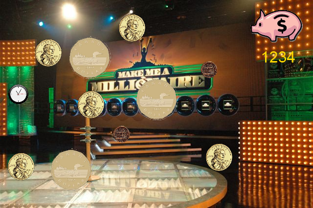

Assignment 3
============

Due Mar 1 by 11:59pm - Points 50

### Introduction

A mini game is a game that lasts only a few seconds to a few minutes per play. Nintendo released an entire “game” made up of mini games called, “WarioWare”.  Each mini game lasted at most 5 seconds.  Actually, these are called micro games and that is much closer to what you are going to do for this mid-term test.

After years of applying, you've finally been selected to participate in the most popular game show on earth, “Coin Drop”. In this game, you try to grab as many coins as you can, banking the money you capture. Grab the Roman coins for a high jackpot, grab the clock to get additional coins dropped, but avoid grabbing any Canadian coins, those reset your score!

### Assignment

The basic gameplay is that of coins dropping from random locations across the top of the screen and moving down to the bottom. Players click US and Roman coins to earn money, click the clock to gain additional coins, but if a Canadian coin is clicked, their current score is reset to 0. Each time a coin is clicked, a small and tasteful shower of $ particles takes place at that coin location, with the player score increasing by the coin amount. This is a fast paced game, the coins drop fairly quickly.

Game Graphics: [Link](assignment/assign3-images.zip)

### Gameplay Requirements

* Each coin is worth the following:
  * US Coin: $10
  * Roman Coin: $50
  * Canadian Coin: Reset current score to zero!
* Create three levels, with each level having the following coins/clocks
  * Level 1
    * US Coins: 10
    * Roman Coins: 3
    * Canadian Coins: 8
    * Clocks: 1 (5 additional US coins)
  * Level 2
    * US Coins: 15
    * Roman Coins: 4
    * Canadian Coins: 12
    * Clocks: 1 (8 additional US coins)
  * Level 3
    * US Coins: 20
    * Roman Coins: 5
    * Canadian Coins: 15
    * Clocks: 1 (10 additional US coins)
* Player must earn $100 to advance to the next level, up to three levels can be played.
* At the start of each level, display a “starting in 3 (2, 1)” message to give the player a chance to get ready, then automatically transition to the gameplay.
* You can determine how fast the coins drop, but this should be a fairly fast game. You must use a Gaussian distribution to determine how fast a coin drops. In other words, each coin will drop at a slightly different rate, but keep the distribution (standard deviation) pretty small.
* Coins drop from a uniformly random selected position at the top of the screen, then moves towards the bottom. Do not have coins drop over the score area.
* The timing of when and which coin drops is also randomly selected. In other words, each time the game is played, when and the order in which coins are selected is different.
* The clock drops mid-way through the level, with the additional coins added to the mix of remaining coins to be dropped.
* The relative size of the coins and clock should be approximately what is shown in the mockup. In general, the clock and Roman coins are small, the US coins medium and the Canadian coins large.
* Scoring is shown below the piggy bank. Again, don't allow coins to drop through this part of the screen.

### Technical Requirements

* HTML5 & Canvas (of course)
* Menu and game screen system
  * New Game
  * High Scores (Show top 3, plus top 3 for each level)
  * Credits
  * Exit
* Visual Components
  * I have provided graphics to use.
  * You may use a different background, but not a solid color. Part of the purpose of the background is to make it a little confusing for the player to see the coins.
* High scores must persist to the browser using local storage
  * Total Score
  * Score for each level

### Grading Breakdown

* Menus: 10 %
* Scoring: 5%
* High Scores: 10 % (Requires scoring)
* Random coin selection, drop location & timing: 15%
* US Coin: 5%
* Roman Coin: 5%
* Clock: 5%
* Level Start Countdown: 10%
* General Gameplay: 15%
* Particles: 10%
* Other Visual: 10%
* Bonus points awarded for doing something extra (e.g., make the coins spin)
* Negative points taken for clear laziness, hacked/poor coding, etc.

### Mockup

